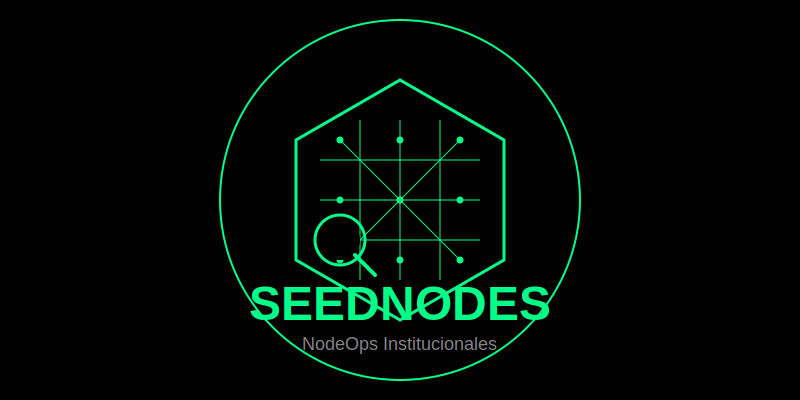

<div align="center">
  
</div>

We are a team of blockchain infrastructure engineers and operators with a single goal: to run nodes and validators to institutional standards. Blockchain infrastructure must be more reliable—and we are here to make it better.

Our mission is to design, deploy, and maintain blockchain node infrastructure with automated, auditable, and scalable processes. We operate to the highest standards of security, transparency, and continuity.

We run validators on leading web3 networks, including Ethereum, Gnosis, Starknet, Aztec, and more.

---

<div align="center">

[](https://x.com/SeedsPuntoEth)
[](https://github.com/NoaSEED/seedops-institutional)

</div>

## Project Structure

```
seedops-institutional/
├── INOH/                          # Institutional Node Operations Handbook
│   └── institutional-handbook.en.md
├── playbooks/                     # Technical playbooks per network
│   ├── ethereum.en.md
│   ├── gnosis.en.md
│   ├── starknet.en.md
│   ├── starknet-sepolia.en.md
│   └── aztec.en.md
├── scripts/                       # Automation scripts
│   ├── 00_bootstrap.sh            # System bootstrap
│   ├── aztec_installer.sh         # Aztec Sequencer installer
│   └── starknet_sepolia_installer.sh
├── templates/                     # Config templates (Jinja2)
├── compose/                       # Docker Compose per network
├── env/                           # Environment examples per network
├── monitoring/                    # Prometheus/Grafana provisioning
├── audit-logs/                    # Operation evidence
└── docs/
```

## Implementation Phases

- Phase 1: Research and baseline standards
- Phase 2: INOH (handbook), security standards, audit procedures
- Phase 3: Network playbooks (Ethereum, Gnosis, Starknet, Aztec)
- Phase 4: Monitoring & reporting (KPIs, dashboards)
- Phase 5: Continuous improvement (quarterly reviews)

## NodeOps Automation

- Current: automated scripts (bootstrap, hardening, deploy, monitor, backup, incident)
- Advanced: automated vulnerability detection and hardening; encrypted daily backups; automated incident response with notifications
- Multi‑network orchestration: unified CI/CD, centralized security and monitoring
- Predictive monitoring: resource trends, early threat detection, preventive scaling

## Quickstart: Starknet Sepolia (Pathfinder)

1) Variables de entorno
```bash
cp env/starknet-sepolia.env.example env/starknet-sepolia.env
nano env/starknet-sepolia.env
```

2) Levantar nodo
```bash
set -a && source env/starknet-sepolia.env && set +a
docker compose -f compose/starknet-sepolia.docker-compose.yml up -d pathfinder
```

3) Con monitoreo (opcional)
```bash
docker compose -f compose/starknet-sepolia.docker-compose.yml --profile monitoring up -d
```

4) Comandos útiles
```bash
docker compose -f compose/starknet-sepolia.docker-compose.yml ps
docker compose -f compose/starknet-sepolia.docker-compose.yml logs -fn 200 pathfinder
docker compose -f compose/starknet-sepolia.docker-compose.yml pull && \
docker compose -f compose/starknet-sepolia.docker-compose.yml up -d
```

Endpoints: RPC `http://<ip>:9545`, Metrics `http://<ip>:9187`, Prometheus `http://<ip>:9090`, Grafana `http://<ip>:3000` (admin por defecto `admin`).

---

## Institutional Security

- Zero‑trust: VPN + MFA, no hardcoded secrets
- Auditability: every action recorded in `audit-logs`
- Security testing: attack simulations via playbooks

## Integrated Audits

Each process produces verifiable evidence:
- Infrastructure: timestamp, actor, host, commit hash, result
- Security: post‑hardening checklist
- Backups: SHA256 + restore test
- Monitoring: metrics and SLA validation

## Deliverable

Every operational action at SEEDNodes generates complete audit evidence. Deployments, updates, and backups require verifiable proof to be considered valid—ensuring transparency, traceability, and trust for delegators, foundations, and stakeholders.

